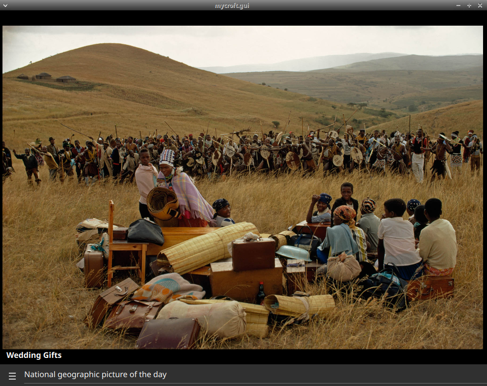

#  National geographic Picture of the Day

## About

[National Geographic Picture of the Day](https://www.nationalgeographic.com/photography/photo-of-the-day/)
  
Can be used as idle screen

## Examples
* "National Geographic picture of the day"
* "explain"

## Credits
- JarbasAi
- [National Geographic](https://www.nationalgeographic.com/photography/photo-of-the-day/)

## Category
**Entertainment**

## Tags
- nasa
- mark2
- desktop
